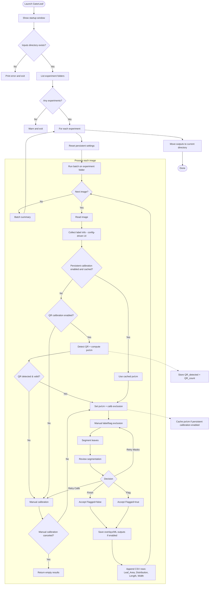
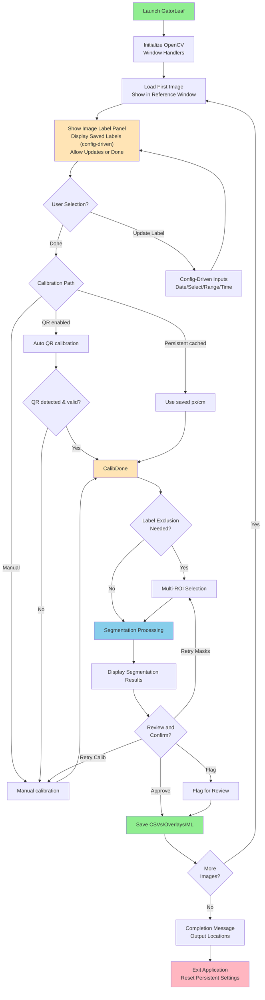
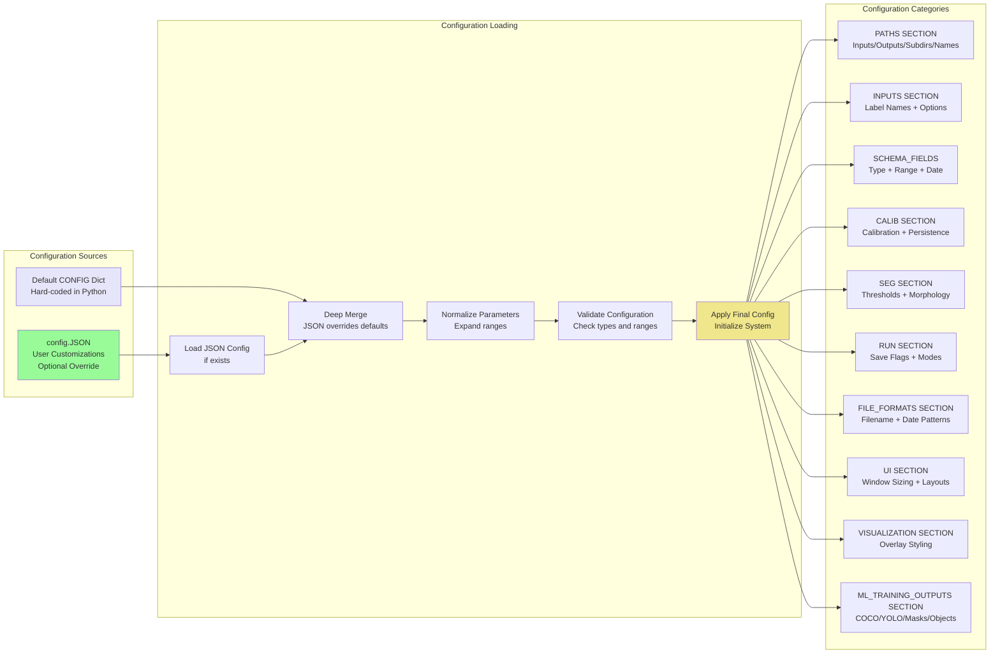
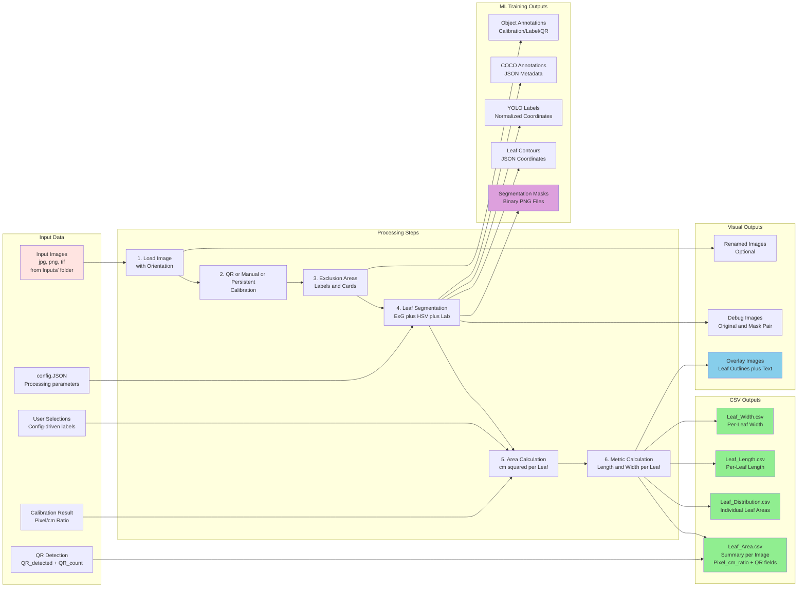
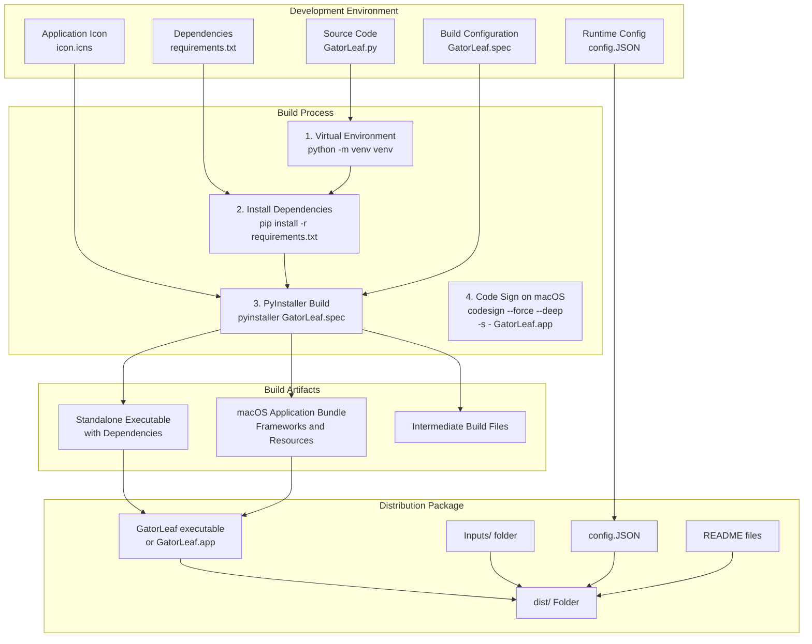
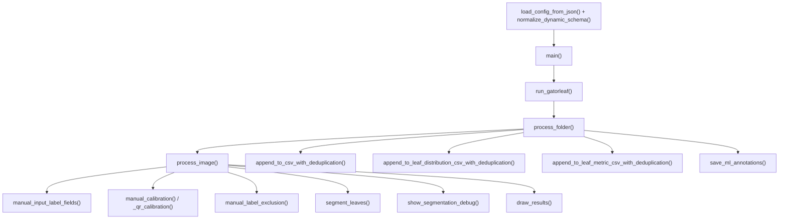

# GatorLeaf - Application Architecture

This document provides visual diagrams of the GatorLeaf application architecture and workflows using Mermaid diagrams. This reflects the current version with config-driven labels, QR calibration, and persistent calibration support.

## Application Architecture Overview

```mermaid
graph TB
    subgraph "User Interface Layer"
        UI[OpenCV Interactive Windows]
        ImageLabel["Image Label Panel<br/>Config-Driven Labels"]
        InputDialogs["Selection Dialogs<br/>Date/Select/Range/Time"]
        Display[Image Display and Review]
    end
    
    subgraph "Core Application"
        Main[GatorLeaf.py Main Entry]
        Config[Configuration Manager<br/>config.JSON]
        Debug[Debugger Class]
        Persistent["Persistent State<br/>Date + Labels + Calibration"]
    end
    
    subgraph "Image Processing Pipeline"
        CalibrationMgmt["Calibration Management<br/>QR or Manual or Persistent"]
        LabelExclude["Label Exclusion Areas<br/>Multi-ROI Selection"]
        Seg["Leaf Segmentation<br/>ExG plus HSV plus Lab"]
        Analysis["Leaf Analysis<br/>Area/Length/Width"]
        Metrics["Metric Calculation<br/>Per-Leaf Stats"]
    end
    
    subgraph "Data Management"
        CSVMain[Main CSV Export<br/>Leaf_Area.csv]
        CSVDist[Distribution CSV<br/>Leaf_Distribution.csv]
        CSVMetrics[Metrics CSV<br/>Leaf_Length.csv<br/>Leaf_Width.csv]
        Overlay[Overlay Generation]
        Rename[Optional Rename In-Place]
        MLExport[ML Training Export<br/>Masks/Contours/YOLO/COCO/Objects]
    end
    
    subgraph "External Dependencies"
        CV2[OpenCV cv2]
        NP[NumPy]
        JSON[JSON Config]
    end
    
    subgraph "File System"
        Input_Dir[Inputs/]
        Config_File[config.JSON]
        Output_Dir[Outputs/]
        Overlays_Dir[Overlays/]
        Debug_Dir[Debug_Panels/]
        ML_Dir[ML_Training_Data/]
        Renamed_Dir[Renamed_Images/]
    end
    
    UI --> Main
    ImageLabel --> Main
    InputDialogs --> Main
    Display --> Main
    
    Main --> Config
    Main --> Debug
    Main --> Persistent
    Main --> CalibrationMgmt
    Main --> LabelExclude
    Main --> Seg
    Main --> Analysis
    
    CalibrationMgmt --> CV2
    Seg --> CV2
    Seg --> NP
    Analysis --> NP
    Metrics --> NP
    
    Analysis --> CSVMain
    Analysis --> CSVDist
    Metrics --> CSVMetrics
    Analysis --> Overlay
    Analysis --> Rename
    Seg --> MLExport
    
    Config --> Config_File
    Main --> Input_Dir
    CSVMain --> Output_Dir
    CSVDist --> Output_Dir
    CSVMetrics --> Output_Dir
    Overlay --> Overlays_Dir
    Debug --> Debug_Dir
    MLExport --> ML_Dir
    Rename --> Renamed_Dir
```



## End-to-End Processing Flow (Current)



## User Interface Flow - Selection Dialogs



## Configuration System



## Data Flow and CSV Outputs



## Build and Distribution Process



## Key Functions and Modules



## Global Variables for Persistent Settings

GatorLeaf maintains global values to preserve settings across images in a batch:

```
_persistent_date          : Last selected date (YYYY-MM-DD or partial format)
_persistent_px_per_cm     : Last calculated calibration ratio
_persistent_labels        : Dict of current label values (config-driven names)
```

These values allow users to process multiple images with the same metadata without re-entering information for each image, while still providing the ability to update any field at any time via the Image Label panel buttons.
